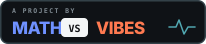

# ArcadeBench

ArcadeBench is a family of inspectable game benchmarks for language models.
Models play through small structured SDKs or build resident controllers that
operate continuously while the model observes, diagnoses, and revises them.

The repository is organized around a shared benchmark runner and artifact
format. Each game owns its simulation, tools, scoring, replay implementation,
and frozen protocol generations.

## Games

- **Partition** *(in development)* — continuous control under moving hazards:
  trace boundaries, partition the field, and stabilize empty regions.

## Design principles

- The authoritative simulation is headless and deterministic where the
  protocol permits it.
- Human rendering never affects scoring.
- Every official result identifies an immutable game protocol generation.
- Runs retain model configuration, transcripts, tool events, usage, scores,
  and replay/controller artifacts.
- Continuous games never pause for model inference. A resident controller
  remains responsible for the player while the model thinks.

See [the architecture](docs/ARCHITECTURE.md) and
[run format](docs/RUN-FORMAT.md) for the platform contracts. The opt-in
[replay sharing contract](docs/REPLAY-SHARING.md) keeps public links independent
from the storage provider.
The [Partition leaderboard contract](docs/LEADERBOARD.md) defines replay-backed
human score submission, ranking, storage, and callsign moderation.

## Workspace

```text
packages/bench-core/   shared contracts, run records, protocol validation
packages/harness/      provider-neutral model and tool orchestration
games/partition/       Partition simulation, controller SDK, and viewer
apps/cli/              family-wide command line interface
apps/board/            cross-game run browser and leaderboard
```

The root commands run matching scripts in every workspace:

```sh
npm install
npm run build
npm test
```

Play Partition locally:

```sh
npm run dev:partition
# http://127.0.0.1:5183/src/viewer/?seed=11
```

Choose **Play** for the paused human start. Arrow keys move along walls; hold
Space with a direction to cut through the field. **Fit Screen** letterboxes the
full 3:2 field, and **Watch Run** sends the current human attempt directly into
the same Replay Lab used for benchmark artifacts.

Inspect the benchmark installation or start a tracked model run:

```sh
npm run bench -- list
npm run bench -- doctor
npm run bench -- run --game partition --generation dev-0 \
  --provider openai --model <model-id> --seed 11 --max-turns 40
```

Partition's current model interface is documented in
[docs/PARTITION-SDK.md](docs/PARTITION-SDK.md). `dev-0` is intentionally
unfrozen; results from it are development evidence, not leaderboard entries.

## Production site

Build the static Cloudflare artifact locally:

```sh
npm run build:site
```

The output is written to `dist/site`. See
[the deployment guide](docs/DEPLOYMENT.md) for CI/CD and custom-domain setup.

---

<a href="https://mathvsvibes.com"></a>
