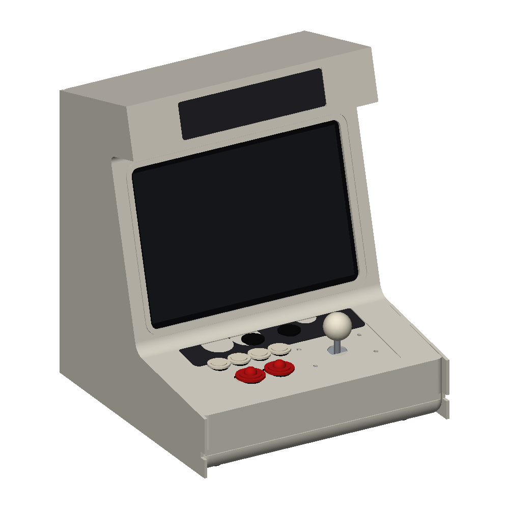
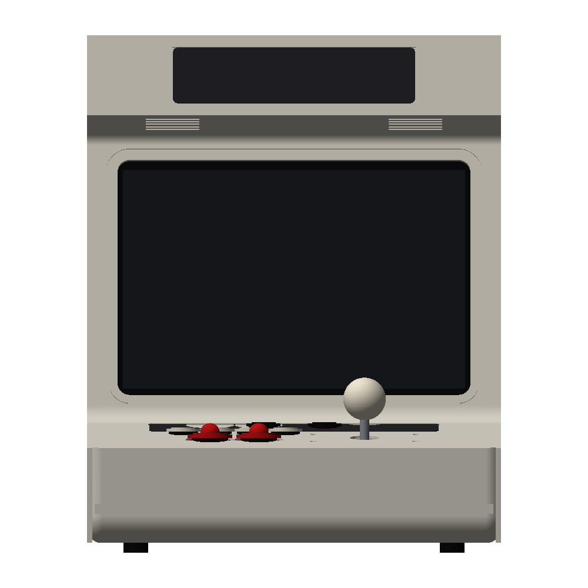
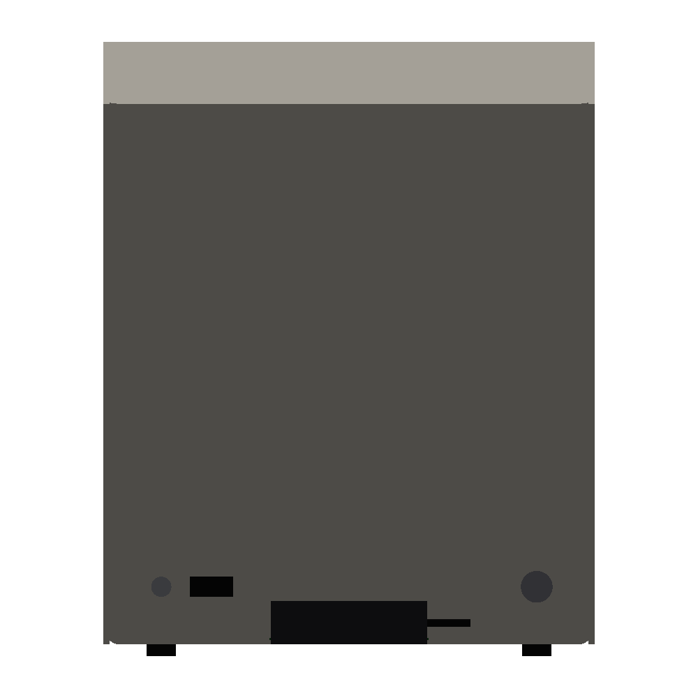
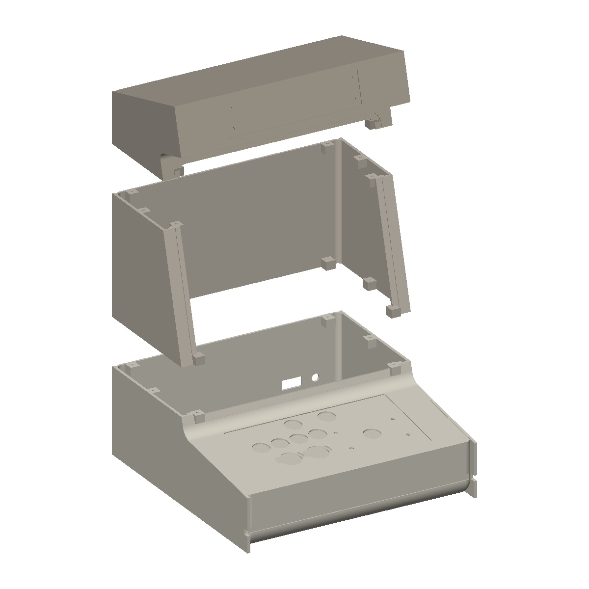
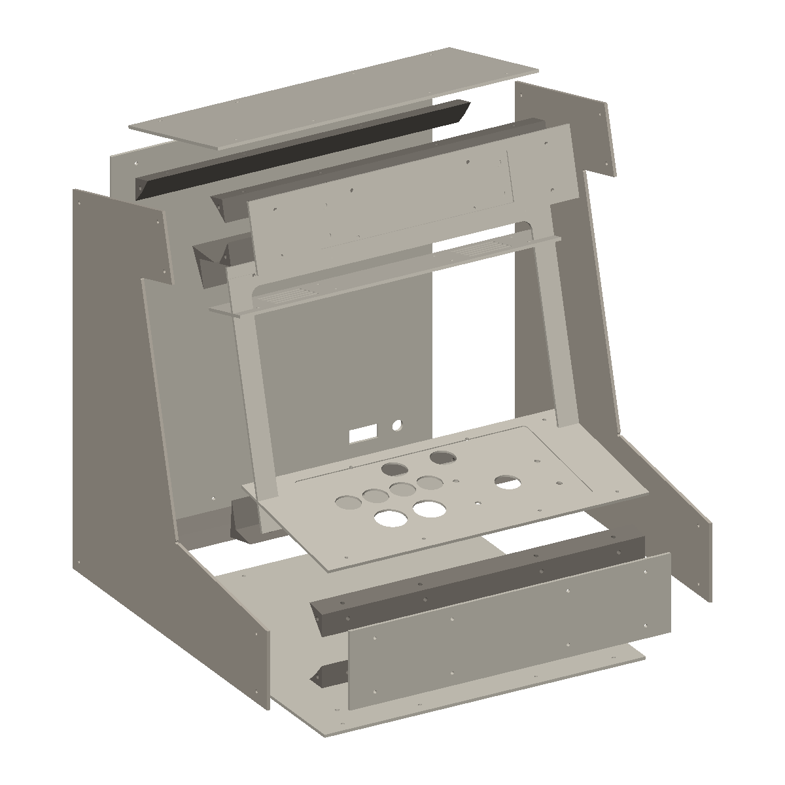

# Hardware: the ArcadeBench bartop cabinet

ArcadeBench is software first, but it deserves a physical home. This document
tracks the design of a tabletop ("bartop") arcade cabinet enclosure sized for
the platform: 3D-printable in parts today, convertible to sheet aluminum
later. Everything here is public and safe to share.

## Design directions under evaluation

Reference concepts live in [`hardware/references/`](../hardware/references/):

- **Cream / rounded** — soft radiused shell, light body, marquee overhang with
  vent slots, accent stripe under the screen.
- **Benchmark instrument** — gray lab-instrument look: VU meter in the marquee,
  side-panel schematic, knurled feet, exposed fasteners.
- **Phosphor** — dark monolithic shell, backlit marquee, amber-terminal mood,
  clean unbroken rear silhouette.

The parametric model is style-neutral; edge treatment, marquee shape, and
accent features are parameters, so any of these directions can be dialed in
without restructuring the model.

## Envelope and layout

- **Single-player** control deck (1P pivot, iteration 16 — all first-party
  games are 1P): 1 × Sanwa JLF joystick (stick-left standard), 2 × OBSF-30
  primary buttons (recessed-well indicators) + 4 × OBSF-24 secondaries,
  2 × OBSF-24 start/select.
- **13.5″ 3:2 3004×2000 hi-DPI IPS** (~267 PPI) behind a 2.5 mm
  polycarbonate window with printed black mask; display deck tilted back
  15° from vertical. First-party games render 3:2 native, edge to edge.
- Envelope **340 × 348 × 417 mm** — the 1P pivot let the screen fill ~84%
  of the face (the 2P version capped at ~49% because the controls set the
  width floor). Full-silhouette **side cheek plates** frame the front,
  jutting 8 mm past the recessed nose fascia (the sheet-metal side-plate
  look; the flat-pack path shares the same overhang).
- 90°-bend hood box (floor/top perpendicular to the display face) with
  down-firing speaker slots in the hood floor and a magnetic swappable
  nameplate inlay on the marquee face.
- Wall thickness 3 mm, internal ribs, fastener bosses accessible from the
  underside, no upward-facing shell seams.
- Two build paths from the same parametric model: **3 printable parts**
  (base / face-column / hood, hidden M3 heat-set-insert joints, all fit a
  360 mm bed) or a **flat-pack of 8 wrap panels + 8 cleats + 2 side
  plates** — the sheet-aluminum path (~3.2 kg in 2 mm 5052).

## Bill of materials

The full internal-parts BOM with subsystem picks, prices, sourcing order, and
order-status tracking lives in [HARDWARE-BOM.md](HARDWARE-BOM.md). BOM items
that constrain the enclosure geometry (power switch, jacks, speaker cavity,
vents, feet, board standoffs) are called out there and mirrored as CAD
parameters.

## Verified component dimensions

| Component | Dimension | Source |
| --- | --- | --- |
| Sanwa JLF-P1 mounting plate | 95 × 53 × 1.6 mm | [Focus Attack](https://support.focusattack.com/hc/en-us/articles/360015744451-Sanwa-JLF-P1-Mounting-Plate-Measurements) |
| JLF plate-to-panel mounting slots | 84 × 40 mm rectangle (slotted, ~Ø5 mm hardware) | [plate drawing](../hardware/references/jlf-p1-plate.jpg) |
| JLF shaft panel hole | 24 mm | [arcadecontrols forum](http://forum.arcadecontrols.com/index.php?topic=144036.0) |
| Sanwa OBSF-30 button hole | 30 mm (snap-in, panel 2–5 mm thick) | [Qanba](https://www.qanba.com/products/sanwa-obsf-30) |
| 13.5″ 3:2 panel (Surface-class kit) | ~296 × 206 × 5 mm outline, 285 × 190 mm active, 3004×2000 — **unverified until the unit arrives** | CAD target; measure before cutting |
| M3 heat-set insert (ruthex class) | 4.6 mm OD × 5.7 mm long → 4.0–4.2 mm printed hole | [CNC Kitchen](https://www.cnckitchen.com/blog/tips-and-tricks-for-heat-set-inserts) |

## Development workflow

The enclosure is parametric code, not hand-drawn CAD:

- Python + [Build123d](https://github.com/gumyr/build123d) in
  `hardware/.venv`; every dimension is a named entry in the `PARAMS` dict at
  the top of [`hardware/cabinet.py`](../hardware/cabinet.py).
- `hardware/.venv/bin/python hardware/cabinet.py` exports STEP + STL plus
  orthographic front/side/top/iso PNG previews to `hardware/out/` for review
  without opening CAD. (`parts.py` = printable split, `panels.py` =
  flat-pack path, `assembly.py` = full BOM fit-check render.)
- Changes are made by editing parameters or structure and re-running; every
  run archives renders + a parameter snapshot to `out/history/`, and the
  full design log is in [`hardware/design-notes.md`](../hardware/design-notes.md).

Status: **iteration 16** — 1P pivot with the 13.5″ 3:2 panel; shell valid,
3 parts printable (0.000 mm³ seam overlap), 26 BOM components placed in the
assembly fit check, 18 flat-pack panels valid. Next: display panel retainer
brackets and the push-to-open keyboard door under consideration.

## Current design (iteration 16)

| Assembled | Front | Side | Rear |
| --- | --- | --- | --- |
|  |  |  |  |

| Printable split (3 parts) | Flat-pack panel path (18 parts) |
| --- | --- |
|  |  |
