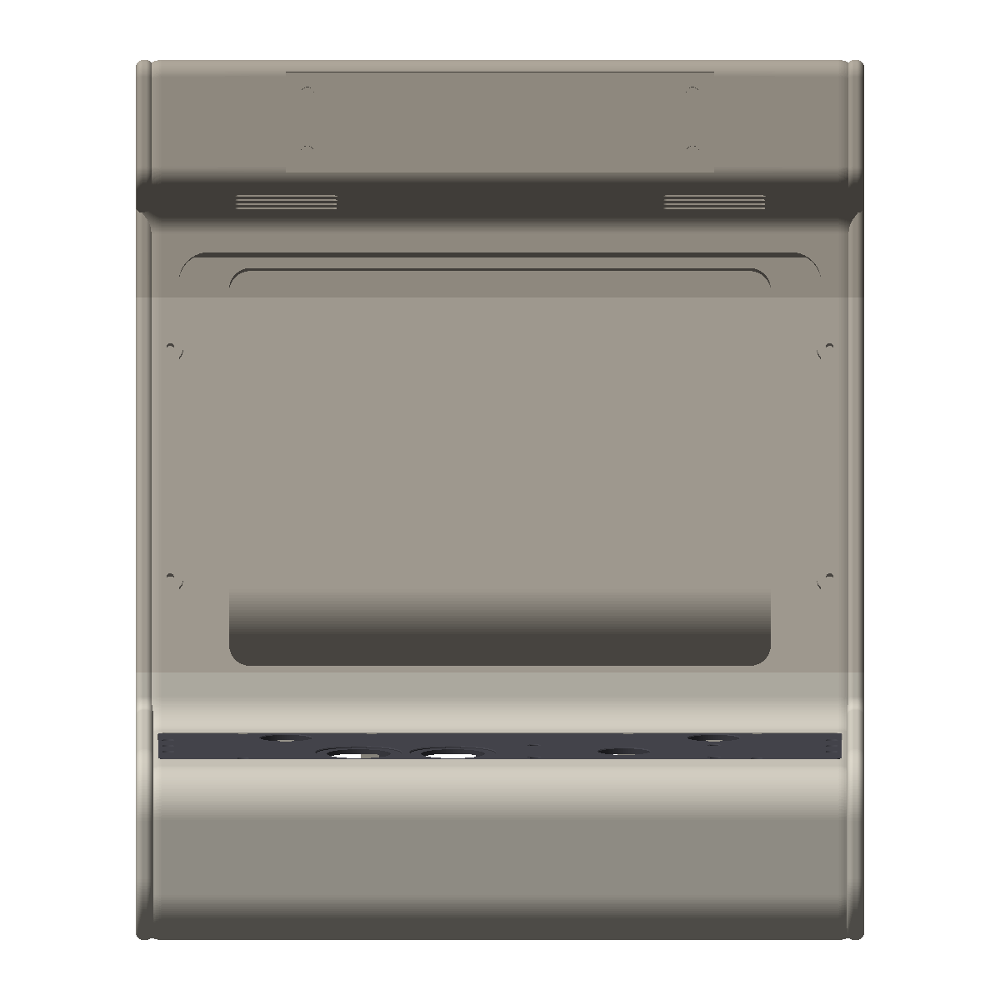
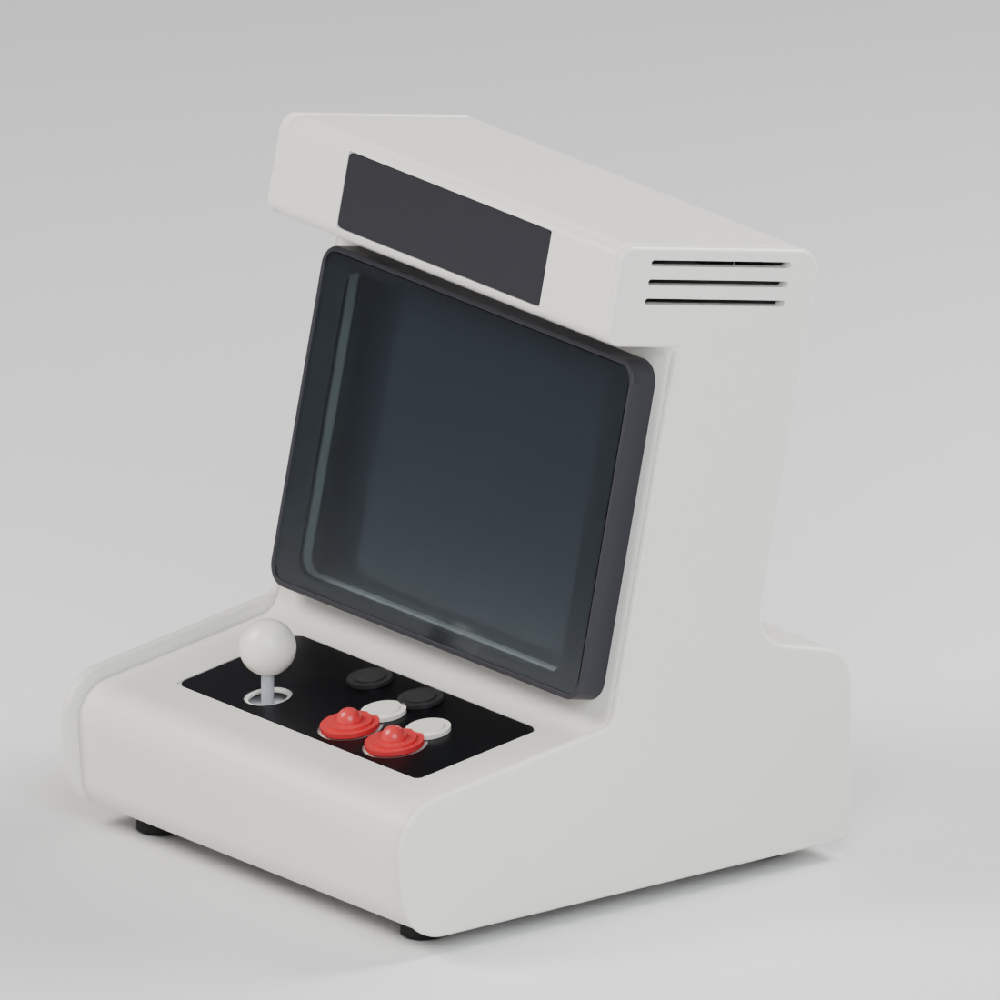
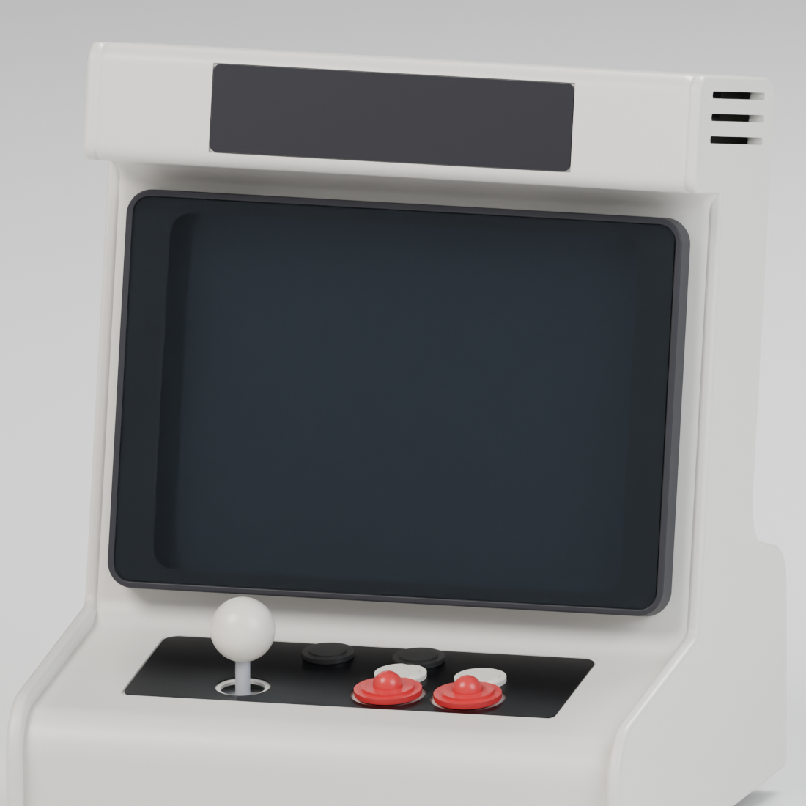
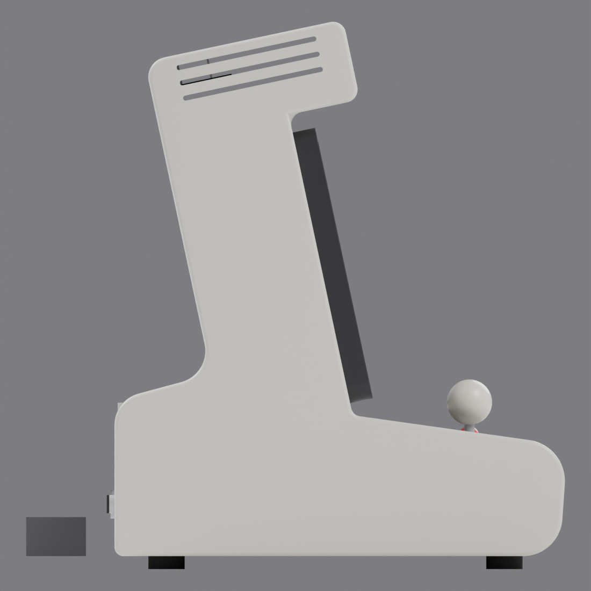
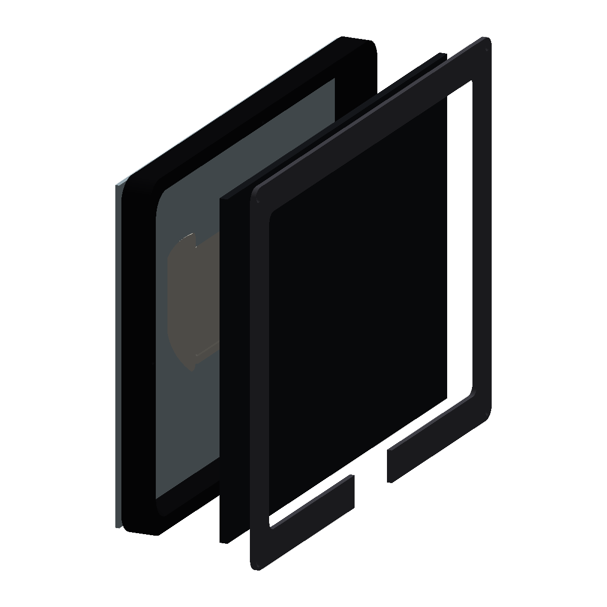
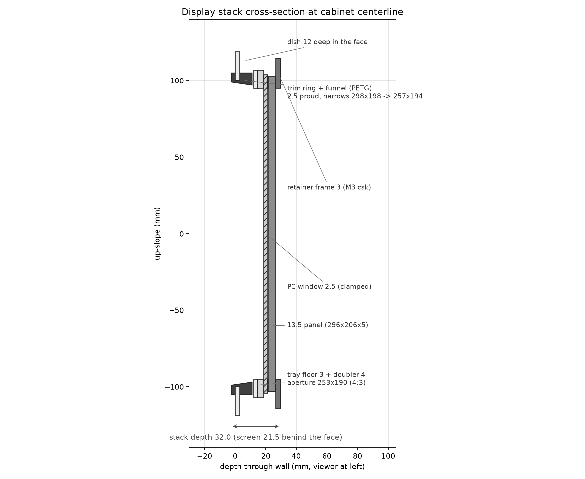
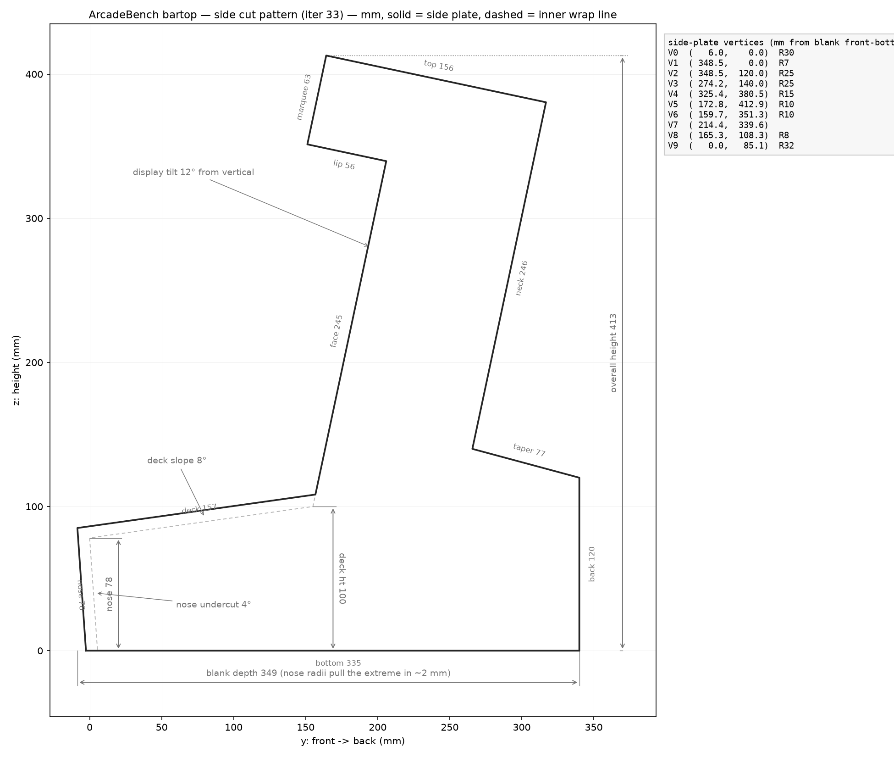
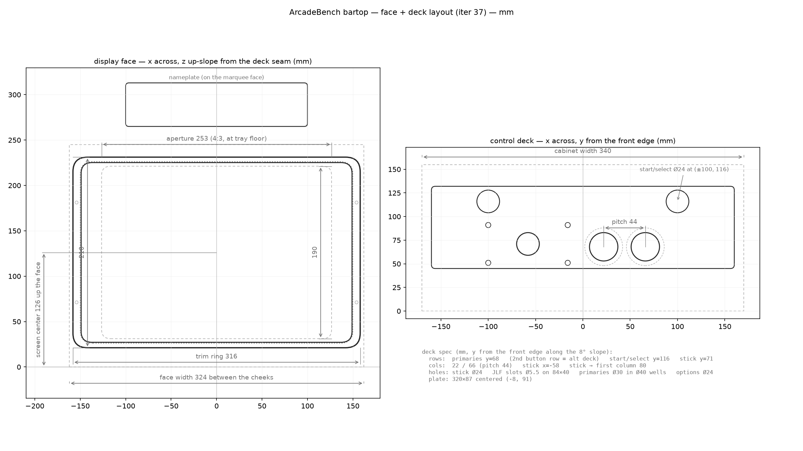

# Hardware: the ArcadeBench bartop cabinet

ArcadeBench is software first, but it deserves a physical home. This document
tracks the design of a tabletop ("bartop") arcade cabinet enclosure sized for
the platform: 3D-printable in parts today, convertible to sheet aluminum
later. Everything here is public and safe to share.

## Design directions under evaluation

Reference concepts live in [`hardware/references/`](../hardware/references/):

- **Cream / rounded** — soft radiused shell, light body, marquee overhang with
  vent slots, accent stripe under the screen.
- **Benchmark instrument** — gray lab-instrument look: VU meter in the marquee,
  side-panel schematic, knurled feet, exposed fasteners.
- **Phosphor** — dark monolithic shell, backlit marquee, amber-terminal mood,
  clean unbroken rear silhouette.

The parametric model is style-neutral; edge treatment, marquee shape, and
accent features are parameters, so any of these directions can be dialed in
without restructuring the model.

## Envelope and layout

- **Single-player** control deck (1P pivot, iteration 16 — all first-party
  games are 1P): 1 × Sanwa JLF joystick (stick-left standard), 2 × OBSF-30
  primary buttons (recessed-well indicators) + 2 × OBSF-24 secondaries in
  an aligned 2×2 grid (iteration 33 — the game roster is stick + 1–2
  buttons), 2 × OBSF-24 start/select.
- **13.5″ 3:2 3004×2000 hi-DPI IPS** (~267 PPI) behind a 2.5 mm
  polycarbonate window; display deck tilted back 12° from vertical. The
  screen sits in an 18 mm-deep **printed CRT bezel** (black PETG): a
  lofted throat flares from the rounded **4:3 mask window** (253 × 190
  mm) you look through back to the panel — the CRT funnel read — with
  the PC window friction-fit into a pocket on the bezel's front face
  (second-surface mask print hides the LCD frame). The bezel bolts on
  from inside the cabinet with 4 hidden M3 screws. First-party games
  render 4:3 into the window. This is the S3 "crt-slim" identity (style
  study, iteration 27; bezel from the chassis brief, iteration 32).
- Envelope **340 × 346.5 × 411 mm** — the 1P pivot let the screen fill
  ~84% of the face (the 2P version capped at ~49% because the controls
  set the width floor). The back wall tapers above the deck
  (`neck_depth` 100 mm — parallel to the face, keeping the 90°-bend
  rule) so the display column reads slim without giving up base depth
  for the computer. Full-silhouette **side cheek plates** frame the
  front: a uniform 8 mm buffer around the front matter — proud of the
  deck surface (the controls sit in a shallow tray) and proud of the
  recessed nose fascia — with corner radii grown by the offset so the
  gap stays constant around the corners (the sheet-metal side-plate
  look; the flat-pack path shares the same overhang). Three raked
  **gill vents** through each cheek in the hood zone (parallel to the
  hood cap) vent the display-driver cavity.
- 90°-bend hood box (floor/top perpendicular to the display face) with
  down-firing speaker slots in the hood floor and a magnetic swappable
  nameplate inlay on the marquee face.
- Wall thickness 3 mm, internal ribs, fastener bosses accessible from the
  underside, no upward-facing shell seams.
- Two build paths from the same parametric model: **4 printable shell
  parts + 4 small parts with a seamless front** (mid + hood print whole,
  base splits front/rear — no seam crosses a front-facing surface; needs
  a 340+ mm bed; a `split_mode: "lr"` 8-part 256 mm-bed fallback keeps
  the old vertical center seams) or a **flat-pack of 10 wrap panels + 2
  side plates** — the sheet-aluminum path (~3.3 kg in 2 mm 5052).

## Chassis architecture (minimal spine-and-sides)

Adopted from the [hardware brief](../hardware/references/hardware-brief-2026-08-19.md)
(iteration 32): the chassis is not a structural cage — **the side plates
are the primary structure**, and the chassis only mounts equipment.

- **Side plates** (flat-pack path): 90° return flanges bent 20 mm inward
  along every wrap segment carry all vertical and torsional rigidity; the
  wrap panels screw into M3 inserts (rivnuts in metal) in the flange
  faces. No corner cleats, no extra vertical supports.
- **Bottom spine**: two 20 × 20 × 1.5 mm aluminum angle rails running
  front-to-back; the SBC rides the rail leg tops. PETG-printable for dev
  units, aluminum for production.
- **Top bracket**: a U-channel across the hood (bolted to the cap)
  carries the display driver board.
- **Joystick**: Sanwa JLF bolts directly to the 3 mm deck plate — no
  sub-plate needed at that thickness.

## Materials and finish

Per the brief's material analysis (small-batch, furniture-grade):

- **Body: 2 mm 5052-H32 sheet aluminum** — formable, weldable,
  laser-friendly; but it does **not** take decorative anodizing (mottled
  dye absorption), so color comes from **powder coat** (recommended,
  $40–80/shell, unlimited colors, hides laser edge grain), **Cerakote**
  (DIY garage option, thin ceramic film, fits the founder-build story),
  or **brushed + 2K clear** (cheapest; raw Dieter Rams option).
- **Control faceplate: 3 mm 6061-T6** — heat-treatable alloy that
  anodizes uniformly; reserve Type II decorative dye (electric blue,
  emerald, …) for this one part. Mask threaded holes before anodizing.
- **Window: 2–3 mm polycarbonate** (not acrylic), anti-glare coating,
  second-surface UV-cured mask print (first-surface print abrades).
- **Fasteners**: rivnuts in sheet metal, M3 heat-set inserts in printed
  parts; no self-tappers into 2 mm sheet under joystick load.

## Bill of materials

The full internal-parts BOM with subsystem picks, prices, sourcing order, and
order-status tracking lives in [HARDWARE-BOM.md](HARDWARE-BOM.md). BOM items
that constrain the enclosure geometry (power switch, jacks, speaker cavity,
vents, feet, board standoffs) are called out there and mirrored as CAD
parameters.

## Verified component dimensions

| Component | Dimension | Source |
| --- | --- | --- |
| Sanwa JLF-P1 mounting plate | 95 × 53 × 1.6 mm | [Focus Attack](https://support.focusattack.com/hc/en-us/articles/360015744451-Sanwa-JLF-P1-Mounting-Plate-Measurements) |
| JLF plate-to-panel mounting slots | 84 × 40 mm rectangle (slotted, ~Ø5 mm hardware) | [plate drawing](../hardware/references/jlf-p1-plate.jpg) |
| JLF shaft panel hole | 24 mm | [arcadecontrols forum](http://forum.arcadecontrols.com/index.php?topic=144036.0) |
| Sanwa OBSF-30 button hole | 30 mm (snap-in, panel 2–5 mm thick) | [Qanba](https://www.qanba.com/products/sanwa-obsf-30) |
| 13.5″ 3:2 panel (Surface-class kit) | ~296 × 206 × 5 mm outline, 285 × 190 mm active, 3004×2000 — **unverified until the unit arrives** | CAD target; measure before cutting |
| M3 heat-set insert (ruthex class) | 4.6 mm OD × 5.7 mm long → 4.0–4.2 mm printed hole | [CNC Kitchen](https://www.cnckitchen.com/blog/tips-and-tricks-for-heat-set-inserts) |

## Development workflow

The enclosure is parametric code, not hand-drawn CAD:

- Python + [Build123d](https://github.com/gumyr/build123d) in
  `hardware/.venv`; every dimension is a named entry in the `PARAMS` dict at
  the top of [`hardware/cabinet.py`](../hardware/cabinet.py).
- `hardware/.venv/bin/python hardware/cabinet.py` exports STEP + STL plus
  orthographic front/side/top/iso PNG previews to `hardware/out/` for review
  without opening CAD. (`parts.py` = printable split, `panels.py` =
  flat-pack path, `assembly.py` = full BOM fit-check render,
  `display_detail.py` = display-stack close-ups + stack cross-section.)
- Photoreal studio renders: `studio_export.py` writes world-coordinate
  meshes + a material manifest, then `studio_scene.py` runs headless in
  Blender (`blender -b --python hardware/studio_scene.py -- --manifest
  hardware/out/studio/manifest.json --outdir hardware/out --views
  hero,display,side --engine CYCLES`) with PBR materials — powder coat
  (orange-peel bump), anodized aluminum, PETG, clear polycarb. Finish
  candidates are re-rendered via `--set powdercoat=r,g,b` overrides.
- Changes are made by editing parameters or structure and re-running; every
  run archives renders + a parameter snapshot to `out/history/`, and the
  full design log is in [`hardware/design-notes.md`](../hardware/design-notes.md).

Status: **iteration 38** — seamless-front "fb" print split: mid + hood
print whole, base splits front/rear (needs a 340+ mm bed; `split_mode:
"lr"` keeps the 8-part 256 mm-bed fallback). Swappable one-piece deck
panel (default layout: stick + 2 OBSF-30 + start/select), printed CRT
bezel, minimal spine chassis, structural flanged side plates; shell
valid, 0.000 mm³ seam overlap, deck panel 0.000 mm³ vs shell, 30 BOM
components placed in the assembly fit check (max overlap 0.294 mm³, a
known JLF plate wedge), 12 flat-pack panels valid. Open call: compute —
ODROID H4+ class stays in the model until the board is picked (H4 Ultra
stock gap; LattePanda Mu N100 is the in-stock path).

## Current design (iteration 38)

| Assembled | Front | Side | Rear |
| --- | --- | --- | --- |
|  |  |  |  |

| Printable split (4 shell parts + 4 extras, seamless front) | Flat-pack panel path (12 parts) |
| --- | --- |
|  |  |

| Assembled parts — seam check (front) | Side |
| --- | --- |
|  |  |

## Studio renders (Blender, photoreal)

Cycles renders from the same model via `studio_export.py` + `studio_scene.py`
— powder-coated shell, PETG CRT bezel, clear PC window, anodized inserts:

| Hero | Display close-up | Side |
| --- | --- | --- |
|  |  |  |

## Display stack detail

The CRT bezel and the full 5-layer display sandwich (PC window → bezel →
shell wall+doubler → panel → retainer), via `hardware/display_detail.py`:

| Exploded stack | Cross-section drawing |
| --- | --- |
|  |  |

## Dimensioned drawings (for the cardboard mockup)

Blueprint-style drawings regenerate from the same PARAMS via
`hardware/.venv/bin/python hardware/drawing.py` — the side view is the
side-plate cut pattern (vertex table + radii included), the front view
locates the window and every control hole.

| Side cut pattern | Face + deck layout |
| --- | --- |
|  |  |

Key numbers: **340 wide × ~347 deep × 413 mm tall**; deck surface 100 mm
high at the seam sloping 8° to a 78 mm nose; display face 245 mm long at
12° from vertical; mask window 253 × 190 (4:3); button rows 68/94 mm from
the deck front edge, columns at x = 22/66, stick at (−58, 67).
